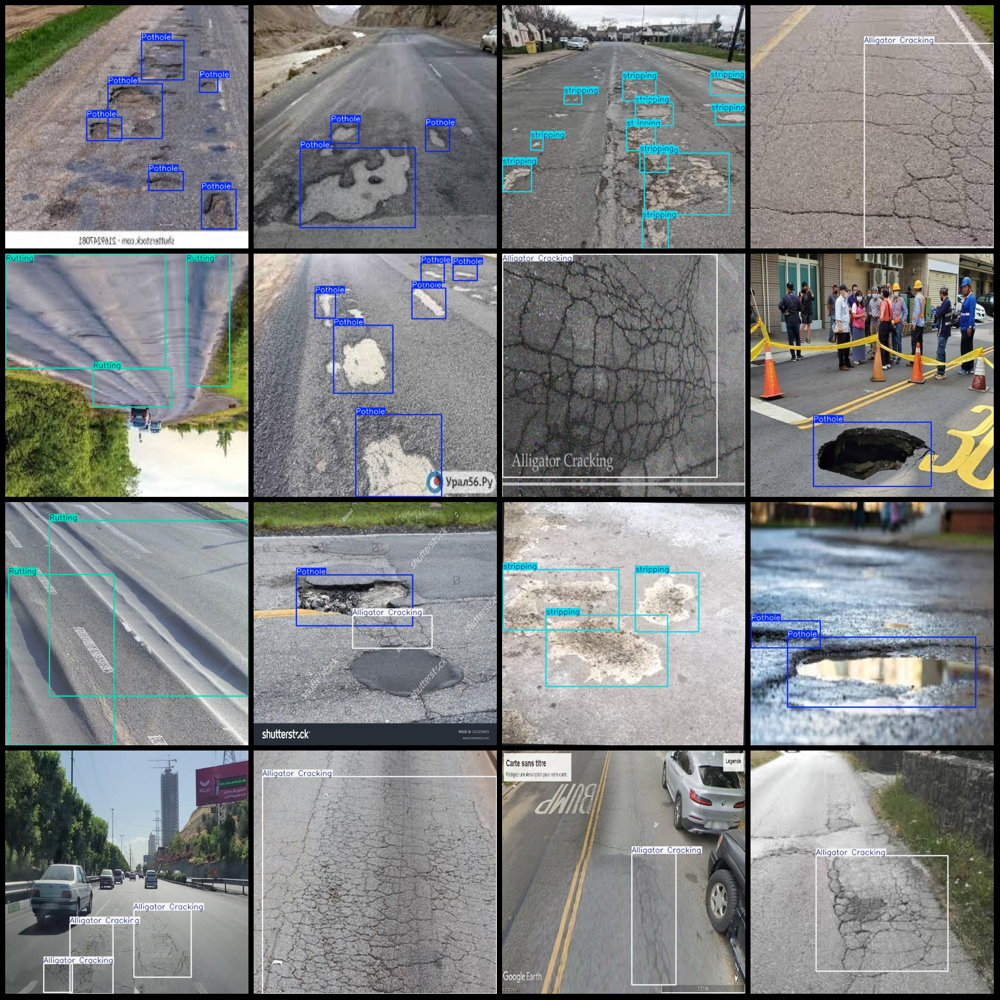
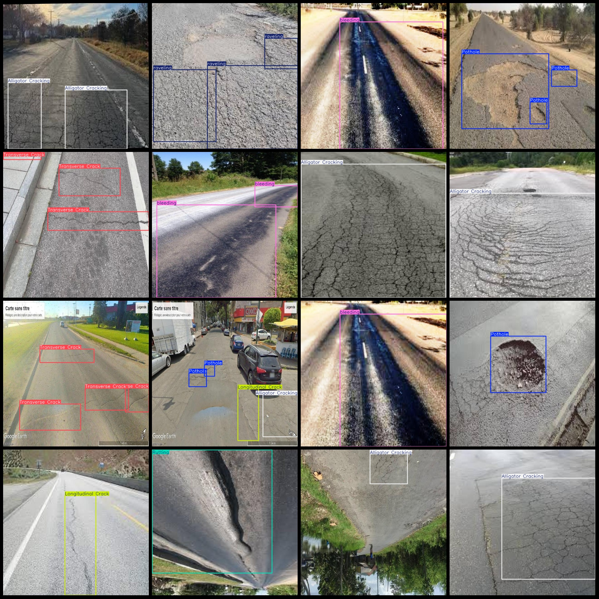

# Smart Traffic Roadway Defects and Highway Damage Detection Dataset - VOC+YOLO Format with 7610 Images, 8 Classes

Dataset format: Pascal VOC format + YOLO format (txt file without split path, only containing jpg images along with corresponding VOC format xml files and YOLO format txt files)
Number of images (jpg file count): 7610
Number of annotations (xml file count): 7610
Number of annotations (txt file count): 7610
Number of categories: 8
Annotation categories name: ["Alligator Cracking", "Longitudinal Crack", "Pothole", "Rutting", "Transverse Crack", "bleeding", "raveling", "stripping"]
Each category has the same number of bounding boxes: 2761 for "Alligator Cracking", 2614 for "Longitudinal Crack", 5835 for "Pothole", 749 for "Rutting", 1723 for "Transverse Crack", 1478 for "bleeding", 1366 for "raveling", and 1149 for "stripping".
Total bounding box count: 17675
Image resolution: 640x640
Dataset is enhanced with many augmented images; specific details can be found in the images.
Annotation tool used: labelImg
Annotation rules: draw bounding boxes for each class.
Important note: No guarantees are made regarding the accuracy of the trained models or weight files.
Image previews:

## Images

Here is a pay link on Stripe ( https://buy.stripe.com/3cs8yP7sY87d0vu9AB ). Please contact me lonlonago@foxmail.com after funding $89, and I will send you a complete data files , thank you!

